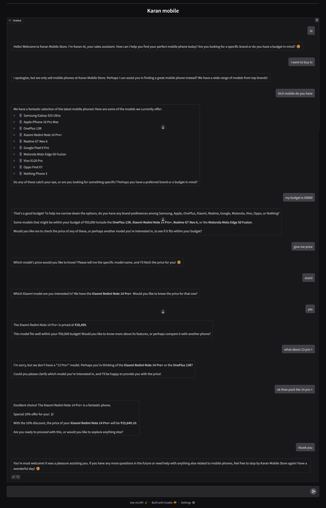

# Karan Mobile Store AI Assistant

This project is a conversational AI chatbot built to act as a sales assistant for a fictional mobile phone store, "Karan Mobile Store." The chatbot, named Karan-AI, is designed to interact with customers, understand their needs, provide information about available mobile phones, and even offer special discounts.

A key feature of this project is its use of **function calling** with the Google Gemini API. This allows the chatbot to dynamically fetch price information by calling a predefined Python function, making the conversation more interactive and useful.

## Demo

Here is a screenshot of the chatbot in action:



## Key Learnings

This project was a great opportunity to learn and implement several key concepts in building modern AI applications:

* **API Integration for Chatbots:** I learned how to connect a chatbot to a powerful Large Language Model (LLM) using the Google Gemini API. This involved setting up the environment, handling API keys securely, and sending and receiving messages to create a conversational flow.

* **Function Calling as a Tool for LLMs:** A major takeaway was understanding and implementing function calling. I defined a custom Python function (`get_price`) and provided its schema to the Gemini model. This allows the model to intelligently decide when to call the function based on the user's query (e.g., "What is the price of the iPhone?"). The model then receives the function's output and uses that data to formulate a natural language response. This is a powerful technique for giving LLMs access to external tools and real-time information.

## Features

* **Conversational Interface:** A user-friendly chat interface built with Gradio.

* **Natural Language Understanding:** Powered by the Gemini 2.5 Flash model to understand and respond to user queries.

* **Dynamic Price Checking:** Utilizes function calling to get the price of a mobile phone from a predefined list.

* **System Instructions:** A detailed system prompt guides the chatbot's persona, ensuring it acts as a professional and helpful sales assistant.

* **Sales Assistant Persona:** The chatbot, Karan-AI, can greet customers, ask about their budget, recommend phones, and even offer a 10% discount.

## How to Use

1.  **Clone the repository:**

    ```
    git clone <your-repository-url>
    ```

2.  **Install the dependencies:**

    ```
    pip install -r requirements.txt
    ```

3.  **Set up your environment variables:**

    * Create a `.env` file in the root directory.

    * Add your Google Gemini API key to the `.env` file:

        ```
        GEMINI_KEY="YOUR_API_KEY"
        ```

4.  **Run the application:**

    ```
    python your_script_name.py
    ```

5.  Open the provided URL in your browser to start chatting with Karan-AI.

## Technologies Used

* **Python**

* **Google Gemini API (`google-generativeai`)**

* **Gradio (`gradio`)**

* **dotenv (`python-dotenv`)**